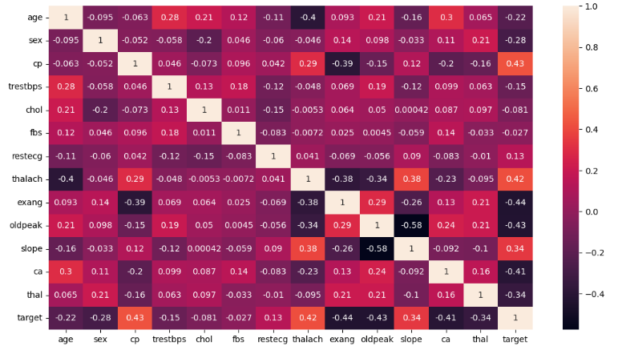

# heart-disease-analysis-python
Performed data cleaning, exploratory data analysis, and correlation study to identify key features influencing heart disease. Separated categorical/continuous variables, visualized gender-based insights, and prepared data for future predictive modeling

# Python Dashboard Portfolio

This repository contains an interactive dashboard built in python using different libraries like pandas,seaborn,matplotlib  for analyzing and visualizing Heart Disease Analysis data.

## 📊 Project Overview

- **Tool Used:** Jupyter notebook using Python (Pandas, NumPy, Matplotlib, Seaborn)
- **Features:** Data cleaning, exploratory data analysis (EDA), correlation heatmap, visual insights
- **Purpose:** Understand which features affect heart disease and prepare the dataset for predictive modeling
- **Skills Demonstrated:** Data preprocessing, statistical analysis, visualization, feature exploration

## 💡 Insights

## Some of the key findings from this analysis:

Male Patients Have Higher Heart Disease Rates
Gender-based analysis shows men are affected more than women in this dataset.

Blood Pressure and Cholesterol Levels Are Important Indicators
Continuous variable distributions show abnormal resting blood pressure and cholesterol values are more common among patients with heart disease.

Strong Feature Correlations Identified
The correlation heatmap highlights relationships among variables, such as age and blood pressure, which are useful for predictive modeling.

# Working and Images with insights

1. Import the Libraries and Dataset:
The project kicks off by importing essential Python libraries for data analysis, including Pandas, Matplotlib, and Seaborn. The dataset, which contains information related to heart disease, is loaded for exploration and analysis

2. Display Top 5 Rows of the Dataset:
An initial glimpse into the dataset is provided by showcasing the first five rows. This step offers an overview of the columns and their corresponding data, including factors such as age, sex, and various health metrics.

3. Check the Last 5 Rows of the Dataset:
Similarly, the last five rows of the dataset are examined to ensure completeness and observe any potential patterns or anomalies.

4. Find the Shape of the Dataset:
The dimensions of the dataset, indicating the number of rows and columns, are determined. This step sets the stage for understanding the scale of the dataset.

5. Get Information About the Dataset:
A detailed overview of the dataset is obtained, providing insights into the total number of rows, columns, and the data types of each column. This information aids in structuring subsequent analyses.

6. Check Null Values in the Dataset:
The presence of missing values is assessed to ensure data integrity. Fortunately, the dataset is found to be free of any null values.

7. Check for Duplicate Data and Drop Them:
Duplicate records, if any, are identified and subsequently removed. This step is crucial for maintaining the accuracy and reliability of the dataset.

8. Get Overall Statistics About the Dataset:
A comprehensive statistical summary of the dataset is generated, offering key metrics such as mean, standard deviation, and quartiles. This statistical insight aids in understanding the central tendencies of the data.

9. Draw Correlation Matrix:
To explore relationships between different features, a correlation matrix is visualized using a heatmap. This step facilitates the identification of potential correlations among variables.

!(10.PNG)

11. Heart Disease Incidence:
The dataset is analyzed to determine the number of individuals with and without heart disease. A count plot visually represents this distribution.

12. Gender Distribution:
The gender distribution within the dataset is examined, providing insights into the proportion of males and females.
!(11.PNG)

13. Gender Distribution According to the Target Variable:
A more nuanced analysis explores how the gender distribution varies concerning the target variable, distinguishing between individuals with and without heart disease.
!(12.PNG)

14. Age Distribution:
The distribution of ages in the dataset is visualized through a histogram, offering insights into the age range of the individuals under study.
!(13.PNG)

15. Chest Pain Type Analysis: 
An analysis of chest pain types, categorized into four values, is conducted. A count plot reveals the prevalence of each chest pain type.
!(14.PNG)

16. Chest Pain Distribution as Per Target Variable:
This analysis delves into how chest pain types are distributed concerning the target variable, providing insights into their correlation with heart disease incidence.
!(15.PNG)
!(16.PNG)

17. Fasting Blood Sugar Distribution:
The distribution of fasting blood sugar levels is examined, differentiating between individuals with and without heart disease.
!(17.PNG)

18. Resting Blood Pressure Comparison by Sex:
A comparative analysis explores how resting blood pressure varies between males and females.
!(18.PNG)

19. Plot Continuous Variables:
Finally, continuous variables are identified, and histograms are generated to visualize their distributions. This step adds depth to the exploration of the dataset.
!(19.PNG)
In conclusion, the "Heart Disease Data Analysis Project" employs a systematic approach to explore and understand the dataset, unraveling key patterns and insights related to heart health. Each step contributes to a comprehensive analysis, enabling meaningful interpretations and potential avenues for further investigation.

🔗 About Me
- [LinkedIn Profile](https://www.linkedin.com/in/muhammad-ali-saleem-69b892245/)
